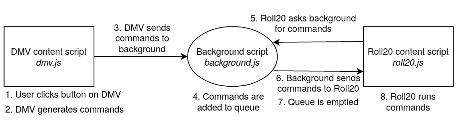

# Development

- [Development](#development)
  - [Building the extension](#building-the-extension)
  - [Running the extension](#running-the-extension)
  - [Testing the extension](#testing-the-extension)
  - [Modifying the extension](#modifying-the-extension)
  - [How the extension works](#how-the-extension-works)

## Building the extension

> Requirements: [Git](https://git-scm.com/), [Yarn](https://yarnpkg.com/)

```sh
# Clone the repository
git clone https://github.com/averycrespi/vtt-bridge.git && cd vtt-bridge

# Install dependencies
yarn

# Install build tools
yarn global add parcel web-ext

# Build the extension package
yarn build
```

Build notes:
- The `KNOWN_LIBRARY` notice is caused by `polyfill.js` and can be safely ignored.
- The `UNSAFE_VAR_ASSIGNMENT` warnings are caused by Parcel and can be safely ignored.
- The ` Accessing non-existent property '*' of module exports inside circular dependency` warnings are caused by [certain Node dependencies](https://github.com/nodejs/node/issues/32987) and can be safely ignored.

## Running the extension

> Prerequisites: [Building the extension](#building-the-extension)

> Requirements: [Firefox](https://www.mozilla.org/en-CA/firefox/), [Chromium](https://www.chromium.org/)

```sh
# Build the extension package
yarn build

# Start Firefox with the extension loaded
# The `firefox` binary must be in your $PATH
# The Firefox profile will be saved in `.profiles/firefox`
yarn firefox:run

# Start Chromium with the extension loaded
# The `chromium-browser` binary must be in your $PATH
# The Chromium profile will be saved in `.profiles/chromium`
yarn chromium:run
```

## Testing the extension

> Prerequisites: [Building the extension](#building-the-extension)

> Requirements: [Python](https://www.python.org/) 3.6 (or newer), [geckodriver](https://firefox-source-docs.mozilla.org/testing/geckodriver/), [chromedriver](https://chromedriver.chromium.org/)

```sh
# Build the extension package
yarn build

# Run unit tests
yarn parcel:test

# Run automation tests with Firefox
# The `geckodriver` binary must be in your $PATH
yarn firefox:test

# Run automation tests with Chromium
# The `chromedriver` binary must be in your $PATH
yarn chromium:test

# Run all unit and automation tests
yarn test
```

See [tests/README.md](tests/README.md) for more information about automation tests.

## Modifying the extension

> Prerequisites: [Building the extension](#building-the-extension)

> Warning: If you create your own version of the extension, you will NOT receive automatic updates

If you want to modify the extension, you can create your own version of VTT Bridge.

```sh
# Clone the repository
git clone https://github.com/averycrespi/vtt-bridge.git && cd vtt-bridge
```

For example, you can modify the extension to support your personal DMV server.

```diff
// Edit the "content_scripts" array in `manifest.json`.
// For each domain you want to support, add a string to the `matches` array.
content_scripts": [
    {
-     "matches": ["*://www.dungeonmastersvault.com/pages/dnd/5e/characters/*?frame=true"],
+     "matches": [
+           "*://www.dungeonmastersvault.com/pages/dnd/5e/characters/*?frame=true",
+           "*://example.com/pages/dnd/5e/characters/*?frame=true",
+     ],
      "js": ["dist/polyfill.js", "dist/dmv.js"],
      "css": ["dist/dmv.css"]
    },
    {
      "matches": ["*://app.roll20.net/editor*"],
      "js": ["dist/polyfill.js", "dist/roll20.js"],
      "css": ["dist/roll20.css"]
    }
  ]
```

After editing `manifest.json`, you must rebuild the extension with your changes.

```sh
# Build the extension package
yarn build

# Find the packaged extension file in `web-ext-artifacts/`
ls web-ext-artifacts
# e.g. vtt_bridge-1.2.3.zip
```

Next, you will need to manually install the packaged extension file:

- Firefox: Follow the "For advanced users" section of the [Mozilla documentation](https://support.mozilla.org/en-US/kb/find-and-install-add-ons-add-features-to-firefox#w_how-do-i-find-and-install-add-ons).
- Chrome/Chromium: Visit [chrome://extensions](chrome://extensions), enable "Developer mode", then drag-and-drop the `.zip` file.

## How the extension works



The extension runs 2 [content scripts](https://developer.mozilla.org/en-US/docs/Mozilla/Add-ons/WebExtensions/Anatomy_of_a_WebExtension#Content_scripts) and 1 [background script](https://developer.mozilla.org/en-US/docs/Mozilla/Add-ons/WebExtensions/Anatomy_of_a_WebExtension#Background_scripts), which perform the following tasks:

- `dmv.js`: Add event listeners to DMV and send commands to `background.js`.
- `background.js`: Receive commands from `dmv.js` and send commands to `roll20.js`.
- `roll20.js`: Receive commands from `background.js` and run commands on Roll20.

This structure is necessary because of the limits of browser extensions.

Ideally, we would like to send commands directly from DMV to Roll20.

```
// Ideal case: direct message passing
DMV content script -> Roll20 content script
```

However, you cannot send messages [from one content script to another](https://stackoverflow.com/questions/47313507/send-message-from-content-script-to-another), so we must use a background script as a relay.

```
// Workaround: background script relay
DMV content script -> background script -> Roll20 content script
```

Unfortunately, sending a message [from a background script to an arbitrary content script](https://stackoverflow.com/questions/14245334/sendmessage-from-extension-background-or-popup-to-content-script-doesnt-work) requires the [tabs permission](https://developer.mozilla.org/en-US/docs/Mozilla/Add-ons/WebExtensions/Working_with_the_Tabs_API). This permission allows the extension to "create, modify, and rearrange tabs in the browser", which is unnecessarily powerful. To sidestep this permission, we implement a polling mechanism.

```
// Workaround: polling mechanism
DMV content script -> background script <-> Roll20 content script
```

At regular intervals (e.g. every second), the Roll20 content script will [send a request to the background script](https://developer.mozilla.org/en-US/docs/Mozilla/Add-ons/WebExtensions/Content_scripts#Communicating_with_background_scripts). The background script will receive this request, then reply with a list of commands. Neither the request nor the reply require additional permissions.

In the future, this polling mechanism could be improved by using the [runtime.Port API](https://developer.mozilla.org/en-US/docs/Mozilla/Add-ons/WebExtensions/API/runtime/Port).