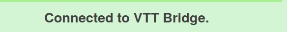

     
    
     
    <h1>VTT Bridge</h1>

    <h4>A browser extension that connects Dungeon Master's Vault to Roll20.</h4>

    
    
    
    
    

    <a href="#about">About</a> •
    <a href="#getting-started">Getting Started</a> •
    <a href="#faq">FAQ</a> •
    <a href="#development">Development</a> •
    <a href="#credits">Credits</a> •
    <a href="#license">License</a>

     
    

## About

VTT Bridge connects your Dungeon Master's Vault character sheet to your Roll20 game.

With the click of a button, you can:

- Attack with weapons
- Cast cantrips and spells
- Roll ability scores, initiative, saving throws, skills, and tools
- Use actions, bonus actions, features, and reactions

Advanced features:

- <kbd>Ctrl+Click</kbd> to roll with advantage
- <kbd>Shift+Click</kbd> to roll with disadvantage

**Disclaimer**

The use of this tool is meant for use for your own campaigns. It is only meant and should only be used on campaigns with content that you legally possess. The use of this tool may violate the [Roll 20 Marketplace Asset EULA](https://wiki.roll20.net/Marketplace_Asset_EULA) or the [Roll 20 Terms of Service](https://wiki.roll20.net/Terms_of_Service_and_Privacy_Policy). This tool is not affiliated with Dungeon Master's Vault, Roll20, or Wizards of the Coast.

## Getting Started

Install the VTT Bridge extension for Firefox or Google Chrome.

Open your Dungeon Master's Vault character sheet. Click the <kbd>www</kbd> link in the top right, which opens the read-only view.

Click the <kbd>Connect to Roll20</kbd> button.

Open your Roll 20 game in another tab. You should see a notification that says `Connected to Dungeon Master's Vault`.

Click one of the new buttons on your Dungeon Master's Vault character sheet. Your roll will appear in Roll20!

## FAQ

**Help, the "Connect to Roll20" button isn't appearing!**

1. Make sure that you're on the read-only page - NOT the character builder page!
2. Try reloading the page.
3. If the problem persists, [open an issue](https://github.com/averycrespi/vtt-bridge/issues/new).

**Help, the "Connected to Dungeon Master's Vault" notification isn't appearing!**

1. Try reloading the page.
2. If the problem persists, [open an issue](https://github.com/averycrespi/vtt-bridge/issues/new).

## Development

See [DEVELOPERS.md](DEVELOPERS.md) for instructions.

## Credits

Project inspired by [VTT Enhancement Suite](https://ssstormy.github.io/roll20-enhancement-suite/).

Logo derived from [dragon by BGBOXXX Design](https://thenounproject.com/term/dragon/1646665/) from the Noun Project.

## License

[MIT](https://choosealicense.com/licenses/mit/)
