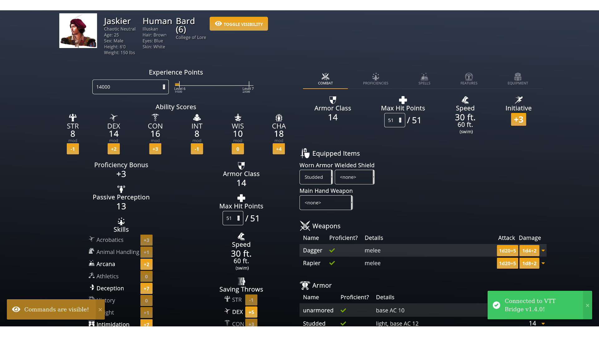

     
    
     
    <h1>VTT Bridge</h1>

    <h4>A browser extension that connects
        <a href="https://www.dungeonmastersvault.com/">Dungeon Master's Vault</a>
        to
        <a href="https://roll20.net/">Roll20</a>.
    </h4>
    

    
    

    
    

    
    
    

  

  <a href="#about">About</a> •
  <a href="#key-features">Key Features</a> •
  <a href="#getting-started">Getting Started</a> •
  <a href="#project-status">Project Status</a> •
  <a href="#support">Support</a> •
  <a href="#credits">Credits</a> •
  <a href="#privacy">Privacy</a> •
  <a href="#license">License</a>
  

    

## About

Do you play D&D on [Roll20](https://roll20.net), but prefer to manage your characters with [Dungeon Master's Vault](https://www.dungeonmastersvault.com)?

VTT Bridge seamlessly connects your Dungeon Master's Vault character sheet to your Roll20 game.

## Key Features

- Roll ability checks, attack with weapons, cast spells, and more!
- <kbd>Ctrl-Click</kbd> to roll with advantage and <kbd>Shift-Click</kbd> to roll with disadvantage.
- Switch between visible commands (everyone can see) and hidden commands (only you and the GM can see).

## Disclaimer

The use of this tool is meant for use for your own campaigns. It is only meant and should only be used on campaigns with content that you legally possess. The use of this tool may violate the [Roll20 Marketplace Asset EULA](https://wiki.roll20.net/Marketplace_Asset_EULA) or the [Roll20 Terms of Service](https://wiki.roll20.net/Terms_of_Service_and_Privacy_Policy). This tool is not affiliated with Dungeon Master's Vault, Roll20, or Wizards of the Coast.

## Getting Started

**Install the extension** for [Mozilla Firefox](https://addons.mozilla.org/en-CA/firefox/addon/vtt-bridge/) or [Google Chrome](https://chrome.google.com/webstore/detail/vtt-bridge/fadncbccmelchegmlghbhpjchdmghmhh):

**Open your Dungeon Master's Vault character sheet** and click the <kbd>www</kbd> link in the top right.

**Launch your Roll20 game** in another tab. You should see a notification appear in both tabs.

**Click a button** on your Dungeon Master's Vault character sheet. Your roll will appear in Roll20!

## Project Status

VTT Bridge is in maintenance mode, which means that I don't plan to add any new features.

However, I will continue to release updates for the following reasons:
- To upgrade dependencies and fix security issues
- To maintain compatibility with the latest versions of Dungeon Master's Vault and Roll20

## Support

- For answers to common questions, check the [FAQ](https://github.com/averycrespi/vtt-bridge/wiki/FAQ).
- For development information, check the [project wiki](https://github.com/averycrespi/vtt-bridge/wiki).
- To see if a problem has already been reported, check the [issues tab](https://github.com/averycrespi/vtt-bridge/issues).
- To ask for help or give feedback, join the `#vtt-bridge` channel on the [DMV Discord server](https://discord.gg/FM2RED77gK).

## Credits

- Project inspired by [VTT Enhancement Suite](https://ssstormy.github.io/roll20-enhancement-suite/).
- Logo derived from [dragon by BGBOXXX Design](https://thenounproject.com/term/dragon/1646665/) from the Noun Project.

## Privacy

VTT Bridge does not collect, store, or transmit any data.

## License

[MIT](https://choosealicense.com/licenses/mit/)
