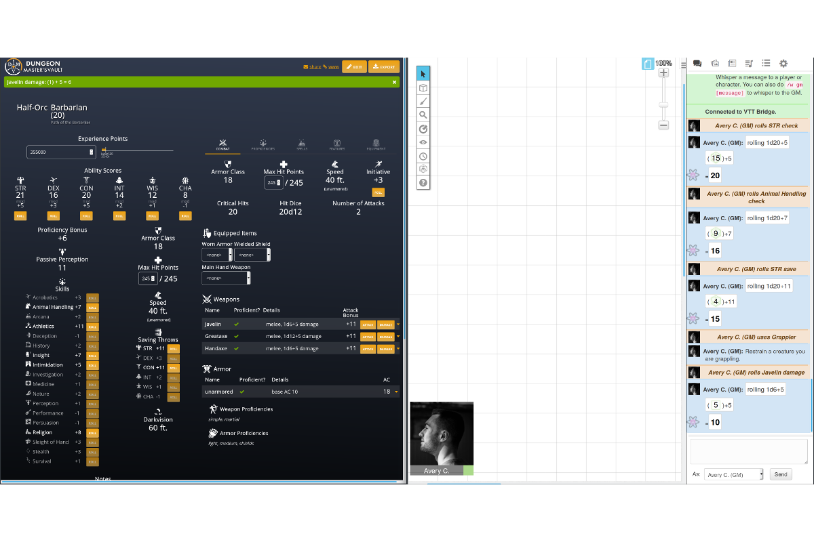

     
    
     
    <h1>VTT Bridge</h1>

    <h4>A browser extension that connects Dungeon Master's Vault to Roll20.</h4>

    
    
    
    
    

    <a href="#about">About</a> •
    <a href="#getting-started">Getting Started</a> •
    <a href="#faq">FAQ</a> •
    <a href="#development">Development</a> •
    <a href="#credits">Credits</a> •
    <a href="#license">License</a>

    

## About

VTT Bridge connects your Dungeon Master's Vault character sheet to your Roll20 game.

With the click of a button, you can:

- Attack with weapons
- Cast spells
- Roll checks
- ... and much more!

Advanced usage:

- `Ctrl-Click` to roll with advantage.
- `Shift-Click` to roll with disadvantage.
- Hold down <kbd>h</kbd> to toggle roll visibility. Rolls can be *visible* (seen by everyone) or *hidden* (seen only by you and the GM).

**Disclaimer**

The use of this tool is meant for use for your own campaigns. It is only meant and should only be used on campaigns with content that you legally possess. The use of this tool may violate the [Roll 20 Marketplace Asset EULA](https://wiki.roll20.net/Marketplace_Asset_EULA) or the [Roll 20 Terms of Service](https://wiki.roll20.net/Terms_of_Service_and_Privacy_Policy). This tool is not affiliated with Dungeon Master's Vault, Roll20, or Wizards of the Coast.

## Getting Started

Install the VTT Bridge extension for Firefox or Google Chrome.

Open your Dungeon Master's Vault character sheet. Click the <kbd>www</kbd> link in the top right. The URL should now end with `?frame`.

Launch your Roll 20 game in another tab.

Click one of the buttons on your Dungeon Master's Vault character sheet. Your roll will appear in Roll20!

## FAQ

**I found a bug! What should I do?**

[Open an issue](https://github.com/averycrespi/vtt-bridge/issues/new/choose) and select "Bug report". Complete the issue template.

**I have an idea for a new feature! What should I do?**

[Open an issue](https://github.com/averycrespi/vtt-bridge/issues/new/choose) and select "Feature request". Complete the issue template.

## Development

See [DEVELOPERS.md](DEVELOPERS.md) for instructions.

## Credits

- Project inspired by [VTT Enhancement Suite](https://ssstormy.github.io/roll20-enhancement-suite/).
- Logo derived from [dragon by BGBOXXX Design](https://thenounproject.com/term/dragon/1646665/) from the Noun Project.

## License

[MIT](https://choosealicense.com/licenses/mit/)
