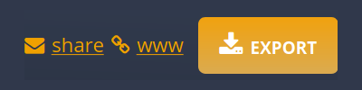

     
    
     
    <h1>VTT Bridge</h1>

    <h4>A browser extension that connects
        <a href="https://www.dungeonmastersvault.com/">Dungeon Master's Vault</a>
        to
        <a href="https://roll20.net/">Roll20</a>.
    </h4>
    

    

        <b>NOTICE: Due to some upcoming DMV changes, the extension may stop working for a short period of time.</b>
    

    

        <b>Thank you for your patience while I fix the incompatibilities.</b>
    

    

     

    
    

    
    

    
    
    

    

## About

Do you play D&D on [Roll20](https://roll20.net), but prefer to manage your characters with [Dungeon Master's Vault](https://www.dungeonmastersvault.com)?

VTT Bridge seamlessly connects your Dungeon Master's Vault character sheet to your Roll20 game.

## Key Features

- Roll ability checks, attack with weapons, cast spells, and more!
- <kbd>Ctrl-Click</kbd> to roll with advantage and <kbd>Shift-Click</kbd> to roll with disadvantage.
- Switch between visible commands (everyone can see) and hidden commands (only you and the GM can see).

## Disclaimer

The use of this tool is meant for use for your own campaigns. It is only meant and should only be used on campaigns with content that you legally possess. The use of this tool may violate the [Roll20 Marketplace Asset EULA](https://wiki.roll20.net/Marketplace_Asset_EULA) or the [Roll20 Terms of Service](https://wiki.roll20.net/Terms_of_Service_and_Privacy_Policy). This tool is not affiliated with Dungeon Master's Vault, Roll20, or Wizards of the Coast.

## Getting Started

**Install the extension** by clicking one of the following icons:

**Open your Dungeon Master's Vault character sheet** and click the <kbd>www</kbd> link in the top right.

**Launch your Roll20 game** in another tab. You should see a notification appear in both tabs.

**Click a button** on your Dungeon Master's Vault character sheet. Your roll will appear in Roll20!

## FAQ

**Help, the buttons on Dungeon Master's Vault aren't working!**

- Make sure that you clicked the `www` link.
- If you are on the correct page, the URL should end with `?frame`.

**Why does VTT Bridge need to "Access your data for www.dungeonmastersvault.com and app.roll20.net"?**

- On Dungeon Master's Vault, the extension adds event listeners to the roll buttons.
- On Roll20, the extension runs commands in the game chat.
- VTT Bridge will *never* make any changes to your account or your content on either site.

**Do I need to have any specific content on Roll20?**

- No. All Dungeon Master's Vault content (including homebrew) will work, regardless of your Roll20 content.

**Do I need to have a Plus/Pro subscription on Roll20?**

- No. VTT Bridge works with a basic (free) Roll20 account.
- The extension will not generate any subscriber-only commands.

**How can I use VTT Bridge with my personal Dungeon Master's Vault server?**

- VTT Bridge does not officially support personal Dungeon Master's Vault servers.
- However, you can follow the instructions in [DEVELOPERS.md](DEVELOPERS.md) to create your own version of the extension.

**I found a bug! What should I do?**

- Make sure that your issue is not covered by the FAQ.
- Check the Issues tab to see if anyone else has reported the same problem.
- [Open an issue](https://github.com/averycrespi/vtt-bridge/issues/new/choose), select "Bug report", then complete the issue template.

## Development

See [DEVELOPERS.md](DEVELOPERS.md) for information about building, testing, and running the extension.

## Credits

Project inspired by [VTT Enhancement Suite](https://ssstormy.github.io/roll20-enhancement-suite/).

Logo derived from [dragon by BGBOXXX Design](https://thenounproject.com/term/dragon/1646665/) from the Noun Project.

## License

[MIT](https://choosealicense.com/licenses/mit/)
